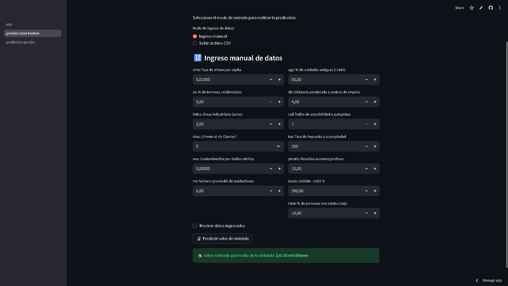
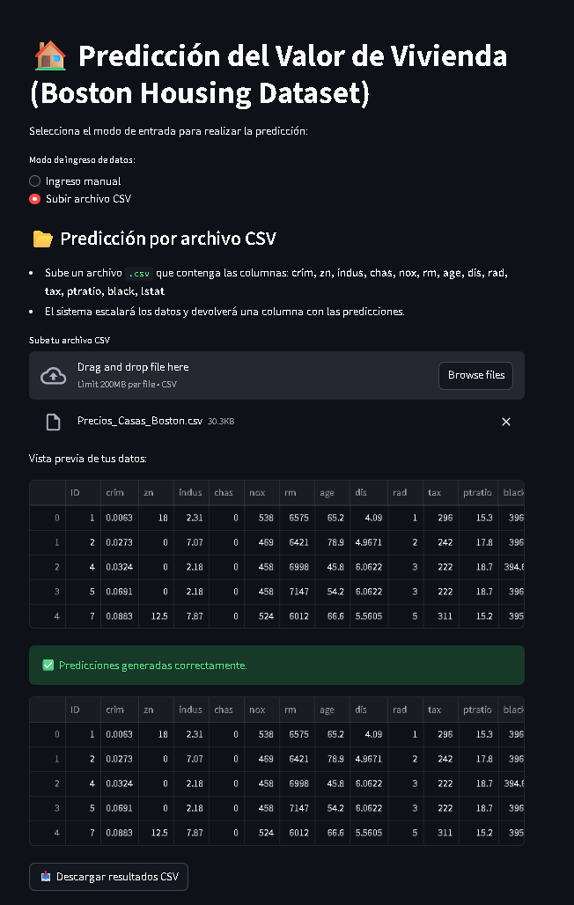

# PROYECTO: Predicción de Precios de Casas en Boston

**Integrante:** Juan Sebastián Sánchez Hincapié

---

## METODOLOGÍA CRISP-DM

---

### 1. ENTENDIMIENTO DEL NEGOCIO

#### 1.1 Descripción del problema

El objetivo principal de este proyecto es **predecir el precio medio de las viviendas en la ciudad de Boston** a partir de diferentes características socioeconómicas y urbanísticas.
Esto permitirá **comprender los factores que más influyen en el valor de una propiedad** y construir un modelo predictivo útil para la toma de decisiones en el sector inmobiliario.

#### 1.2 Diseño de solución

| Tipo de análisis | Tipo de aprendizaje | Posibles métodos                                   | Evaluación      |
| ---------------- | ------------------- | -------------------------------------------------- | --------------- |
| Predictivo       | Supervisado         | KNN, MLP, Regresión Lineal, Árbol de Decisión, SVR | MAE, MAPE, RMSE |

---

### 2. ENTENDIMIENTO DE LOS DATOS

#### 2.1 Variable dependiente

La variable dependiente es aquella que se desea predecir, es desconocida en el futuro.

| Variable | Descripción                                                                       |
| -------- | --------------------------------------------------------------------------------- |
| **MEDV** | Valor medio de las viviendas ocupadas por sus propietarios (en miles de dólares). |

#### 2.2 Variables independientes

Las variables conocidas en el futuro, que permitirán hacer la predicción de la variable dependiente.

| Variable | Descripción                                                                       |
| -------- | --------------------------------------------------------------------------------- |
| CRIM     | Tasa de criminalidad per cápita por ciudad.                                       |
| ZN       | Proporción de terrenos residenciales destinados a lotes de más de 25,000 pies².   |
| INDUS    | Proporción de acres de negocios no minoristas por ciudad.                         |
| CHAS     | Variable ficticia (1 si el tramo limita con el río Charles; 0 en caso contrario). |
| NOX      | Concentración de óxidos nítricos (partes por 10 millones).                        |
| RM       | Número promedio de habitaciones por vivienda.                                     |
| AGE      | Proporción de unidades ocupadas por sus propietarios construidas antes de 1940.   |
| DIS      | Distancia ponderada a cinco centros de empleo en Boston.                          |
| RAD      | Índice de accesibilidad a autopistas radiales.                                    |
| TAX      | Tasa del impuesto a la propiedad por cada 10,000 dólares.                         |
| PTRATIO  | Proporción alumno-profesor por ciudad.                                            |
| B        | 1000(Bk - 0.63)² donde Bk es la proporción de personas negras por ciudad.         |
| LSTAT    | Porcentaje de población de bajo nivel socioeconómico.                             |

#### 2.3 Reglas de calidad

##### Variables numéricas

| Variable | Valor mínimo\* | Valor máximo\* |
| -------- | -------------- | -------------- |
| CRIM     | 0              | 90             |
| ZN       | 0              | 100            |
| INDUS    | 0              | 30             |
| NOX      | 0              | 1              |
| RM       | 3              | 9              |
| AGE      | 0              | 100            |
| DIS      | 0              | 13             |
| RAD      | 1              | 24             |
| TAX      | 100            | 800            |
| PTRATIO  | 10             | 40             |
| BLACK    | 0              | 400            |
| LSTAT    | 0              | 40             |

##### Variables categóricas

| Variable | Valores posibles |
| -------- | ---------------- |
| CHAS     | 0, 1             |

> _Los valores mínimo y máximo son definidos con base en el entendimiento del negocio, no necesariamente los del dataset._

---

### 3. PREPARACIÓN DE DATOS

#### 3.1 Selección de variables desde el conocimiento del negocio

Se seleccionan las variables que más influyen en el precio de las viviendas según estudios previos y correlaciones.

#### 3.2 Descripción estadística

Se realiza un análisis descriptivo con medidas como media, desviación estándar y percentiles para detectar posibles anomalías.

#### 3.3 Limpieza de atípicos

Se identifican y corrigen valores fuera de rango mediante inspección estadística y gráfica (boxplots).

#### 3.4 Limpieza de nulos

No se presentan valores nulos en el dataset original.

#### 3.5 Creación de nuevas variables

Se aplicó **escalado y normalización** de variables numéricas mediante `StandardScaler`.
También se aplicó **One-Hot Encoding** para variables categóricas (ejemplo: CHAS).

#### 3.6 Análisis de relaciones

- **Análisis lineal:** correlación de Pearson para detectar relaciones lineales con `MEDV`.
- **Análisis no lineal:** uso de gráficos de dispersión y modelos de árbol para detectar relaciones no lineales.

#### 3.7 Reducción de dimensiones

Se evaluó la posibilidad de aplicar **PCA**, aunque no fue necesario dado el número reducido de variables.

#### 3.8 Balanceo

No aplica (problema de regresión).

---

### 4. MODELAMIENTO Y EVALUACIÓN

---

#### 4.1 Configuración y selección de métodos de Machine Learning

##### 4.1.1 Modelos clásicos seleccionados

Se implementaron y compararon diversos algoritmos de regresión clásicos, buscando un equilibrio entre interpretabilidad y capacidad predictiva:

- **Bayesian Ridge Regression**
- **K-Nearest Neighbors (KNN) Regressor**
- **Decision Tree Regressor**
- **Multi-Layer Perceptron (MLP) Regressor**

##### 4.1.2 Modelos de Ensamble

Con el objetivo de mejorar la estabilidad y el desempeño del modelo, se probaron técnicas de ensamble que combinan múltiples estimadores:

- **Bagging Regressor**
- **Random Forest Regressor**
- **Stacking Regressor**

---

#### 4.2 Ajuste de hiperparámetros

Se dividieron los datos en **70% para entrenamiento** y **30% para prueba**.
El ajuste de hiperparámetros se realizó mediante **validación cruzada (Cross Validation, k = 5)** para garantizar la robustez de los resultados.

##### 4.2.1 Justificación de la métrica

Las métricas seleccionadas fueron:

- **MAE (Mean Absolute Error)**: facilita la interpretación en unidades monetarias.
- **MAPE (Mean Absolute Percentage Error)**: permite evaluar el error relativo en términos porcentuales.

Debido a su relevancia práctica, **MAPE** fue la métrica principal para la comparación de modelos.

##### 4.2.2 Ajuste de modelos clásicos

Se empleó **GridSearchCV** para optimizar los parámetros más relevantes en cada modelo:

- `n_neighbors` en **KNN Regressor**
- `max_depth` en **Decision Tree Regressor**
- `hidden_layer_sizes` y `alpha` en **MLP Regressor**

##### 4.2.3 Ajuste de modelos de ensamble

Para los modelos de ensamble, se exploraron parámetros como:

- `n_estimators`: número de estimadores o árboles base.
- `max_samples`: proporción de muestras usadas por cada estimador.
- `max_features`: proporción de características seleccionadas aleatoriamente.
- `bootstrap` y `bootstrap_features`: control del muestreo con reemplazo.

---

#### 4.3 Medida de calidad del modelo

##### 4.3.1 Evaluación con conjunto de prueba

El desempeño de los modelos se evaluó con las métricas **MAE**, **MAPE** y **RMSE**, concentrando el análisis en **MAPE** por su claridad interpretativa en términos porcentuales.

##### 4.3.2 Selección del mejor modelo

Entre todos los modelos evaluados, el **Bagging Regressor** mostró el **mejor desempeño general**, alcanzando los siguientes resultados tras una búsqueda expandida de hiperparámetros:

```text
Best parameters for Bagging Regressor (expanded search):
{
  'bootstrap': False,
  'bootstrap_features': True,
  'max_features': 0.9,
  'max_samples': 1.0,
  'n_estimators': 12
}

Best cross-validation MAPE: 0.09962698495234013
Test set MAPE: 0.09
```

---

### 5. DESPLIEGUE

#### 5.1 Construcción del conjunto de datos de entrada

Se preparó un conjunto de datos nuevo con características simuladas o reales.

#### 5.2 Preparación del conjunto de datos

Se aplicaron los mismos pasos de escalado y codificación usados en el entrenamiento.

#### 5.3 Predicción con el modelo

El modelo predice el valor medio de una vivienda en miles de dólares.
Por ejemplo, una vivienda con **RM = 6.5**, **LSTAT = 10**, **DIS = 5** puede tener un valor estimado de **$28,000 USD**.

#### 5.4 Despliegue en aplicación web

El modelo fue implementado usando **Streamlit** y desplegado en **Streamlit Cloud**.
La aplicación permite ingresar datos manualmente o cargar archivos `.csv` para obtener predicciones en tiempo real.

[Haz clic aquí para abrir la aplicación](https://machine-learning-dashboard.streamlit.app/precios_casas_boston)

### ⚙️ **Demostración del funcionamiento**

#### ✍️ **Entrada manual de datos**

En esta vista, el usuario puede **ingresar manualmente** las características de una vivienda (como número de habitaciones, área, antigüedad, etc.) y obtener una **predicción inmediata** del precio estimado:



#### 📁 **Carga de archivo CSV**

La aplicación también permite **subir un archivo `.csv`** con múltiples registros para generar **predicciones por lotes**, automatizando el análisis de varios inmuebles al mismo tiempo:



---

### 💻 Tecnologías utilizadas

- Python
- Pandas, NumPy, Scikit-learn
- Matplotlib, Seaborn
- Streamlit

---

### 👨‍💻 Autor

**Juan Sebastián Sánchez Hincapié**
[LinkedIn](https://www.linkedin.com/in/jssanchezh/)

---

```

```
