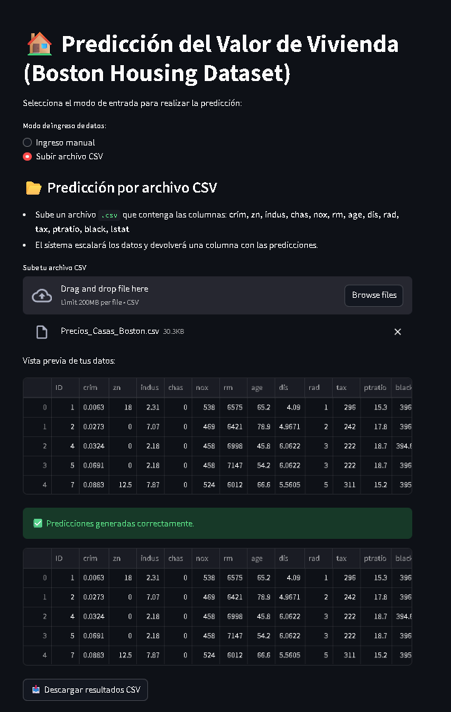

# 🏠 PROYECTO: Predicción de Precios de Casas en Cali

**Integrante:** Juan Sebastián Sánchez Hincapié

---

## METODOLOGÍA CRISP-DM

---

### 1. ENTENDIMIENTO DEL NEGOCIO

#### 1.1 Descripción del problema

El objetivo de este proyecto es **predecir el valor del avalúo catastral de viviendas en la ciudad de Cali**, a partir de variables urbanas y constructivas.
Esto permitirá **identificar los factores que más influyen en el precio de una vivienda** y crear un modelo predictivo que apoye la **toma de decisiones inmobiliarias y catastrales**.

#### 1.2 Diseño de solución

| Tipo de análisis | Tipo de aprendizaje | Posibles métodos                                             | Evaluación      |
| ---------------- | ------------------- | ------------------------------------------------------------ | --------------- |
| Predictivo       | Supervisado         | KNN, MLP, Regresión Lineal, Árbol de Decisión, Random Forest | MAE, MAPE, RMSE |

---

### 2. ENTENDIMIENTO DE LOS DATOS

#### 2.1 Variables originales

El conjunto de datos inicial contenía las siguientes columnas:

| Variable                    | Descripción                                               |
| --------------------------- | --------------------------------------------------------- |
| ID_PREDIO                   | Identificador único del predio.                           |
| NUMERO_PREDIAL_NACIONAL     | Código predial asignado por la autoridad catastral.       |
| COMUNA                      | Número de comuna donde se ubica el predio.                |
| BARRIO                      | Nombre del barrio del predio.                             |
| MANZANA                     | Código de manzana.                                        |
| TERRENO                     | Identificador de terreno.                                 |
| PREDIO                      | Código interno del predio.                                |
| VIGENCIA                    | Año de la vigencia del avalúo.                            |
| DESCRIP_CONDICION_PROPIEDAD | Condición legal del predio (ej. Propio, Arrendado, etc.). |
| ID_TERRENO                  | Identificador interno del terreno.                        |
| AREA_CONSTRUCCION           | Área construida del predio en m².                         |
| AREA_TERRENO                | Área total del terreno en m².                             |
| VALOR_TERR                  | Valor del terreno.                                        |
| VALOR_CONST                 | Valor de la construcción.                                 |
| DESTINO_ECONOMICO           | Tipo de uso del predio (Residencial, Comercial, etc.).    |
| AVALUO                      | Avalúo total del predio (variable objetivo).              |
| AREA_ANEXO                  | Área construida correspondiente a anexos.                 |
| VALOR_ANEXO                 | Valor correspondiente a anexos.                           |

---

### 3. PREPARACIÓN DE DATOS

#### 3.1 Selección de variables relevantes

Se descartaron las columnas con información redundante o no predictiva para el modelo:

```python
cols_a_dropear = [
    'ID_PREDIO', 'NUMERO_PREDIAL_NACIONAL', 'TERRENO', 'PREDIO',
    'ID_TERRENO', 'MANZANA', 'VIGENCIA', 'BARRIO', 'VALOR_TERR',
    'VALOR_ANEXO', 'VALOR_CONST', 'DESTINO_ECONOMICO'
]
df_clean = df.drop(columns=cols_a_dropear)
```

#### 3.2 Creación de nuevas variables

Se creó la variable binaria **TIENE_ANEXO**, que indica si un predio cuenta con área adicional o no, en función del valor de `AREA_ANEXO`:

```python
df_clean['TIENE_ANEXO'] = (df_clean['AREA_ANEXO'] > 0).astype(int)
```

Esta variable permite diferenciar los predios con y sin construcciones anexas, lo que se considera un factor relevante para el avalúo total.

---

#### 3.3 Filtrado de valores extremos en el avalúo

Para asegurar un rango realista de precios, se eliminaron registros con valores de avalúo atípicos o no representativos.
Esto permite centrar el análisis en propiedades con precios dentro de un rango económicamente razonable y comparables entre sí.

```python
df_clean = df_clean[(df_clean['AVALUO'] >= 3e7) & (df_clean['AVALUO'] <= 1e9)]
```

Con esta restricción, se consideraron únicamente predios con avalúos entre **30 millones y 1.000 millones de pesos**, lo cual elimina valores extremos que podrían distorsionar el entrenamiento del modelo.

---

#### 3.4 Limpieza de outliers en área de anexos

Se aplicó un proceso de **detección y limpieza de outliers en las variables numéricas**, pero **solo para los registros donde `TIENE_ANEXO = 1`**.
De esta manera, las propiedades sin anexos (con `AREA_ANEXO = 0`) permanecen sin alteraciones, conservando la validez de esos registros.

El método utilizado fue el rango intercuartílico (IQR), eliminando valores que se encontraban fuera de los límites normales para cada variable.
En el caso de `VALOR_ANEXO`, **no se eliminaron los valores igual a 0**, pues representan predios sin anexos construidos, condición válida dentro del conjunto de datos.

```python
if 'TIENE_ANEXO' not in df_clean.columns:
    df_clean['TIENE_ANEXO'] = (df_clean['AREA_ANEXO'] > 0).astype(int)

mask_anexo = df_clean['TIENE_ANEXO'] == 1

numeric_cols = df_clean.select_dtypes(include=['float64', 'int64']).columns.drop('AVALUO')

df_outliers = df_clean.copy()

replaced_counts = {}

for col in numeric_cols:

    if col == 'AREA_ANEXO':
        series_for_iqr = df_outliers.loc[mask_anexo, col].dropna()
    else:
        series_for_iqr = df_outliers[col].dropna()

    if series_for_iqr.shape[0] < 4:
        replaced_counts[col] = 0
        print(f"Saltando {col}: muestra muy pequeña para IQR ({series_for_iqr.shape[0]} valores).")
        continue

    Q1 = series_for_iqr.quantile(0.25)
    Q3 = series_for_iqr.quantile(0.75)
    IQR = Q3 - Q1

    lower_bound = Q1 - 1.5 * IQR
    upper_bound = Q3 + 1.5 * IQR

    if col == 'AREA_ANEXO':
        outliers_mask = mask_anexo & (
            (df_outliers[col] < lower_bound) | (df_outliers[col] > upper_bound)
        )
    elif col == 'VALOR_ANEXO':
        outliers_mask = (
            ((df_outliers[col] < lower_bound) | (df_outliers[col] > upper_bound))
            & (df_outliers[col] != 0)
            & df_outliers[col].notna()
        )
    else:
        outliers_mask = (
            ((df_outliers[col] < lower_bound) | (df_outliers[col] > upper_bound))
            & df_outliers[col].notna()
        )
```

Con este procedimiento se redujo la influencia de observaciones atípicas sin comprometer la representatividad general del conjunto de datos.

---

#### 3.5 Imputación de valores faltantes

Tras eliminar los outliers, surgieron valores faltantes (`NaN`) en algunas variables numéricas.  
Para evitar pérdida de información, se aplicó **imputación mediante la mediana**, una técnica robusta frente a valores extremos que mantiene la coherencia estadística de las variables.

```python
from sklearn.impute import SimpleImputer

imputer = SimpleImputer(strategy='median')
df_clean[numeric_cols] = imputer.fit_transform(df_clean[numeric_cols])
```

De esta forma, se logró conservar la totalidad de los registros sin introducir sesgos significativos, asegurando una base sólida para el modelamiento.

---

#### 3.6 Análisis de relaciones

En esta etapa se exploraron las **relaciones entre las variables predictoras y la variable objetivo (`AVALUO`)** utilizando diferentes enfoques:

- **Matriz de correlación de Pearson:** para medir la fuerza y dirección de las relaciones lineales.
- **Diagramas de dispersión:** para identificar patrones y relaciones no lineales entre variables como `AREA_CONSTRUCCION`, `AREA_TERRENO` y `AVALUO`.
- **Boxplots por categorías** (por ejemplo, `COMUNA`, `DESCRIP_CONDICION_PROPIEDAD`): para observar variaciones del avalúo según factores geográficos o de propiedad.

Los resultados reflejan una **alta correlación positiva entre `AREA_CONSTRUCCION`, `AREA_TERRENO` y `AVALUO`**, lo que indica que el tamaño del terreno y la construcción son factores determinantes en el valor total.

Asimismo, se observaron **diferencias marcadas en los valores medios de avalúo por comuna**, lo que refuerza la relevancia espacial del atributo `COMUNA`.

---

#### 3.7 Reducción de dimensiones

Posterior al análisis de correlaciones, **no se evidenció una multicolinealidad significativa** entre las variables predictoras.

Por esta razón, **no fue necesario aplicar técnicas de reducción de dimensiones** como **PCA (Análisis de Componentes Principales)** o **LDA (Análisis Discriminante Lineal)** en esta etapa.

No obstante, se considera que estas técnicas podrían resultar útiles en fases futuras del proyecto si se busca:

- Reducir la **carga computacional** en modelos más complejos.
- Eliminar **redundancias** entre variables altamente correlacionadas.
- Explorar **proyecciones visuales** del espacio de características.

En el presente análisis, se mantuvieron todas las variables relevantes con el propósito de **preservar la interpretabilidad** del modelo y permitir una comprensión más clara del impacto de cada predictor sobre el avalúo final de los predios.

#### 3.8 Balanceo

No aplica (problema de regresión).

### 4. MODELAMIENTO Y EVALUACIÓN

---

#### 4.1 Configuración y selección de métodos de Machine Learning

##### 4.1.1 Modelos clásicos seleccionados

Para el problema de regresión de precios de viviendas en Cali, se implementaron y compararon diferentes **modelos clásicos de aprendizaje supervisado** con el objetivo de evaluar su capacidad predictiva y su interpretabilidad:

- **Bayesian Ridge Regression**
- **K-Nearest Neighbors (KNN) Regressor**
- **Decision Tree Regressor**
- **Multi-Layer Perceptron (MLP) Regressor**

Cada uno de estos modelos representa un enfoque distinto dentro de la regresión:

- Los modelos lineales permiten **interpretar los coeficientes** directamente.
- Los métodos basados en vecinos y árboles capturan **relaciones no lineales** entre las variables.
- El MLP (red neuronal) explora **patrones complejos y no lineales** en los datos.

---

##### 4.1.2 Modelos de Ensamble

Tras evaluar los modelos individuales, se incorporaron **técnicas de ensamble** para mejorar la estabilidad y precisión de las predicciones.  
Estas técnicas combinan múltiples estimadores con el fin de reducir la varianza y el sesgo.

Los modelos evaluados fueron:

- **Bagging Regressor**
- **Random Forest Regressor**
- **Stacking Regressor**

Estos métodos permiten aprovechar la diversidad de los modelos base y mejorar la generalización del modelo final.

---

#### 4.2 Ajuste de hiperparámetros

Los datos se dividieron en **70% para entrenamiento** y **30% para prueba**.  
El proceso de optimización de parámetros se realizó mediante **validación cruzada (k = 5)** utilizando `GridSearchCV`, garantizando una búsqueda sistemática de los mejores hiperparámetros para cada modelo.

---

##### 4.2.1 Justificación de las métricas

Se emplearon las siguientes métricas de evaluación para cuantificar el desempeño de los modelos:

- **MAE (Mean Absolute Error):** mide el error promedio absoluto, fácil de interpretar en unidades monetarias.
- **MAPE (Mean Absolute Percentage Error):** evalúa el error relativo, expresado en porcentaje.
- **RMSE (Root Mean Squared Error):** penaliza fuertemente los errores grandes, útil para comparar la estabilidad del modelo.

> Debido a su interpretabilidad práctica, **MAPE** fue utilizada como la métrica principal para la comparación final de los modelos.

---

##### 4.2.2 Ajuste de modelos clásicos

Se realizó una búsqueda de hiperparámetros para los modelos individuales:

- `n_neighbors` en **KNN Regressor**
- `max_depth` en **Decision Tree Regressor**
- `hidden_layer_sizes` y `alpha` en **MLP Regressor**
- `alpha` y `tol` en **Bayesian Ridge Regression**

El objetivo fue encontrar un equilibrio entre complejidad y capacidad de generalización, evitando sobreajuste.

---

##### 4.2.3 Ajuste de modelos de ensamble

Para los modelos de ensamble, se exploraron configuraciones relacionadas con el número de estimadores y la cantidad de muestras utilizadas por cada uno:

- `n_estimators`: número de modelos base o árboles.
- `max_samples`: fracción de datos usada por cada estimador.
- `max_features`: proporción de variables seleccionadas aleatoriamente.
- `bootstrap` y `bootstrap_features`: control del muestreo con reemplazo.

---

#### 4.3 Medida de calidad del modelo

##### 4.3.1 Evaluación con conjunto de prueba

Una vez ajustados los modelos, se evaluó su desempeño utilizando el conjunto de prueba.
Las métricas comparadas fueron **MAE**, **MAPE** y **RMSE**, priorizando la interpretabilidad de los resultados en términos de porcentaje de error relativo.

---

##### 4.3.2 Selección del mejor modelo

Entre los modelos probados (**MLP**, **KNN**, **Decision Tree**, **Bayesian Ridge**, **Random Forest**, **Bagging**, **Stacking**), se identificará aquel con el **menor MAPE en el conjunto de prueba**.

Este modelo será considerado como la **mejor alternativa** para la predicción de precios de viviendas en Cali.

> ⚙️ _Aquí se insertarán los resultados finales de desempeño una vez completada la evaluación._

---

### 5. DESPLIEGUE

#### 5.1 Construcción del conjunto de datos de entrada

Se construyó un conjunto de datos nuevo con características simuladas o reales representativas del mercado inmobiliario caleño.

#### 5.2 Preparación del conjunto de datos

Se aplicaron los mismos procesos de **escalado**, **codificación** y **transformación** utilizados durante el entrenamiento, asegurando consistencia entre el modelo y los nuevos datos de entrada.

#### 5.3 Predicción con el modelo

El modelo final predice el valor estimado de una vivienda en pesos colombianos, a partir de variables como área de construcción, área del terreno, comuna y condición de propiedad.

Por ejemplo, un predio con **200 m² construidos**, **Comuna 19** y **condición “Propio”** puede tener un avalúo estimado de aproximadamente **$420 millones COP**, dependiendo del modelo final seleccionado.

#### 5.4 Despliegue en aplicación web

El modelo será implementado en una aplicación interactiva desarrollada con **Streamlit**, que permitirá al usuario:

- Ingresar manualmente los datos de un predio para obtener una predicción instantánea.
- Cargar un archivo `.csv` con múltiples registros para realizar predicciones masivas.

> [Haz clic aquí para abrir la aplicación](https://machine-learning-dashboard.streamlit.app/precios_casas_cali) _(URL de ejemplo, pendiente de despliegue real)_

---

### ⚙️ **Demostración del funcionamiento**

#### ✍️ **Entrada manual de datos**

Permite ingresar los valores de las variables predictoras y obtener la estimación del avalúo total del predio:


#### 📁 **Carga de archivo CSV**

Facilita el análisis en lote de varios predios mediante la carga de un archivo `.csv`:



---

### 💻 Tecnologías utilizadas

- Python
- Pandas, NumPy, Scikit-learn
- Matplotlib, Seaborn
- Streamlit

---

### 👨‍💻 Autor

**Juan Sebastián Sánchez Hincapié**
[LinkedIn](https://www.linkedin.com/in/jssanchezh/)

---
